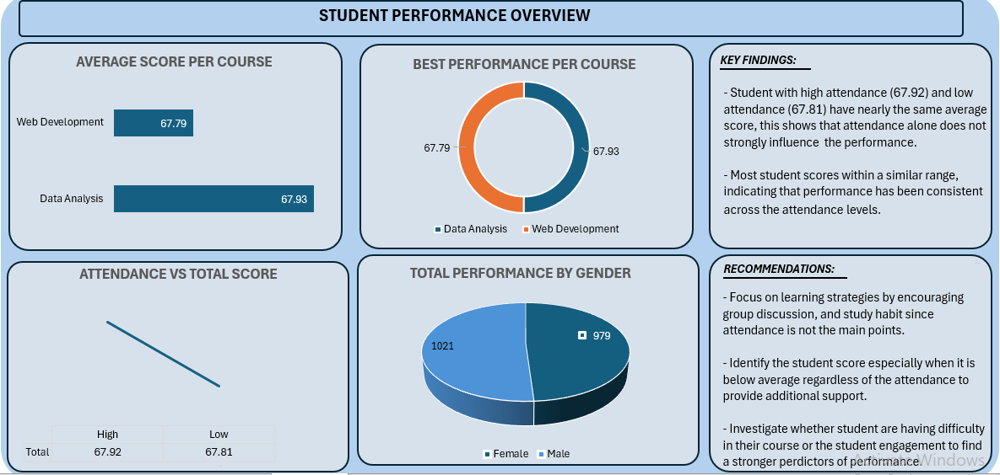

# Student Performance Dashboard
This project analyzes student performance across different courses, attendance levels, and gender categories. The goal is to understand key indicators of academic performance and identify actionable insights.

## Tools Used
Excel 
Data Cleaning
Data Visualization
Basic Statistical Comparison

## Dashboard Components
Average Score per Course
Data Analysis: 67.93

Web Development: 67.79
Performance across both courses is nearly identical.

Attendance vs Total Score
High attendance: 67.92

Low attendance: 67.81

This suggests attendance alone does not strongly influence performance.

Total Performance by Gender
Female: 1021

Male: 979
Performance distribution is fairly balanced.
## Key Insights
- Student performance is consistent across attendance levels.
- Course performance differences are minimal.
- Gender-based performance gap is small.

## Recommendations
- Focus on learning strategies rather than attendance alone.
- Provide support for below-average students.
- Investigate additional factors influencing performance.

## Dashboard Preview

